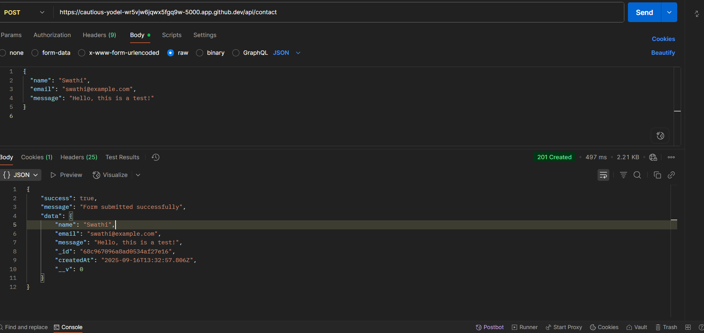
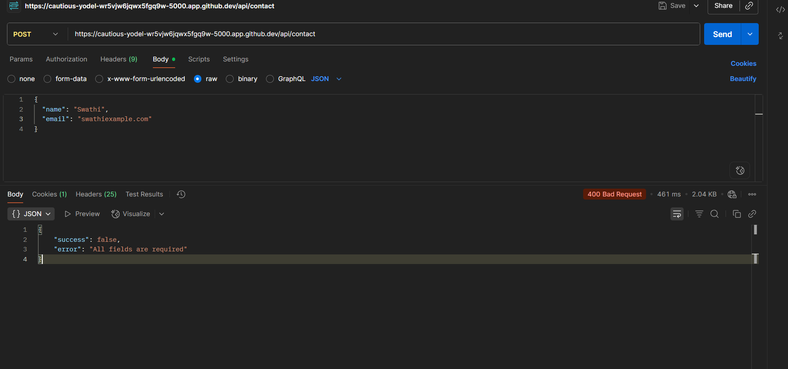
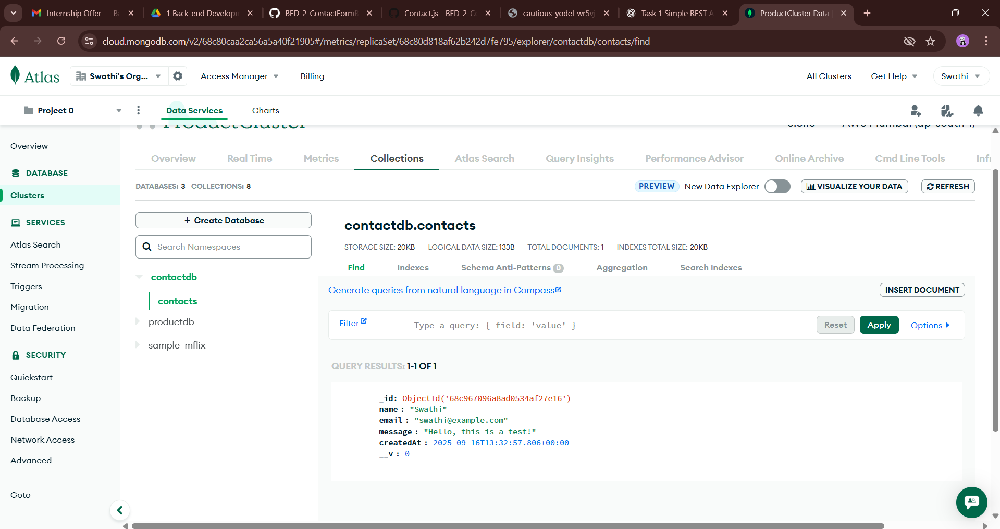

# BED_2_ContactFormBackend_ARITHMATRIX
Task 2: Contact Form Backend (Accept form data and send via email)

# Contact Form Backend - ARITHMATRIX

## Overview
This project is a **backend system to handle contact form submissions**.  
It allows users to submit their **name, email, and message**, which are validated and stored in a **MongoDB Atlas database**.  
The API returns clear **success** or **error** responses for every submission.

- **Domain:** Back-End Development  
- **Task:** 2  
- **Platform:** Node.js, Express.js, MongoDB Atlas  
- **Internship:** ARITHMATRIX  

---

## Features
- Single endpoint to receive contact form submissions: `/api/contact`  
- Server-side validation for required fields and valid email format  
- Data persisted in MongoDB Atlas  
- Clear JSON responses for success and error  
- Public GitHub repository maintained for this task  

---

## Setup Instructions
1. **Clone the repository**

```bash
git clone https://github.com/swathi-gurijala/BED_2_ContactFormBackend_ARITHMATRIX.git
cd BED_2_ContactFormBackend_ARITHMATRIX
Install dependencies

bash
Copy code
npm install
Start the server

bash
Copy code
node server.js
Server runs on port 5000

API Base URL: http://localhost:5000/api/contact

API Endpoints
1. Submit Contact Form
URL: /api/contact

Method: POST

Request Body (JSON):

json
Copy code
{
  "name": "Swathi",
  "email": "swathi@example.com",
  "message": "Hello, this is a test!"
}
Success Response (201):

json
Copy code
{
  "success": true,
  "message": "Form submitted successfully",
  "data": {
    "_id": "68c967096a8ad0534af27e16",
    "name": "Swathi",
    "email": "swathi@example.com",
    "message": "Hello, this is a test!",
    "createdAt": "2025-09-16T13:32:57.806Z"
  }
}

### ✅ Success Response (Postman)
### Success Response



Error Response (400):

json
Copy code
{
  "success": false,
  "error": "Email is required and must be valid"
}

### Failure Response


### MongoDB Submission



2. Get All Submissions
URL: /api/contact

Method: GET

Success Response (200):

json
Copy code
[
  {
    "_id": "68c967096a8ad0534af27e16",
    "name": "Swathi",
    "email": "swathi@example.com",
    "message": "Hello, this is a test!",
    "createdAt": "2025-09-16T13:32:57.806Z"
  },
  {
    "_id": "68c967396a8ad0534af27e17",
    "name": "John",
    "email": "john@example.com",
    "message": "This is another test",
    "createdAt": "2025-09-16T13:35:00.123Z"
  }
]
